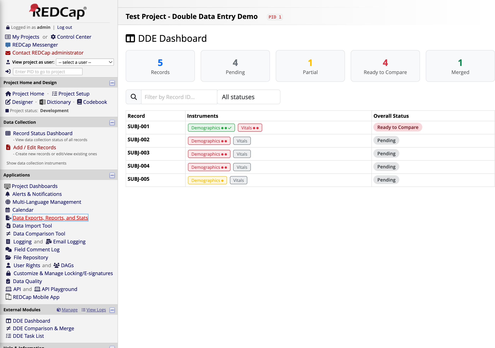
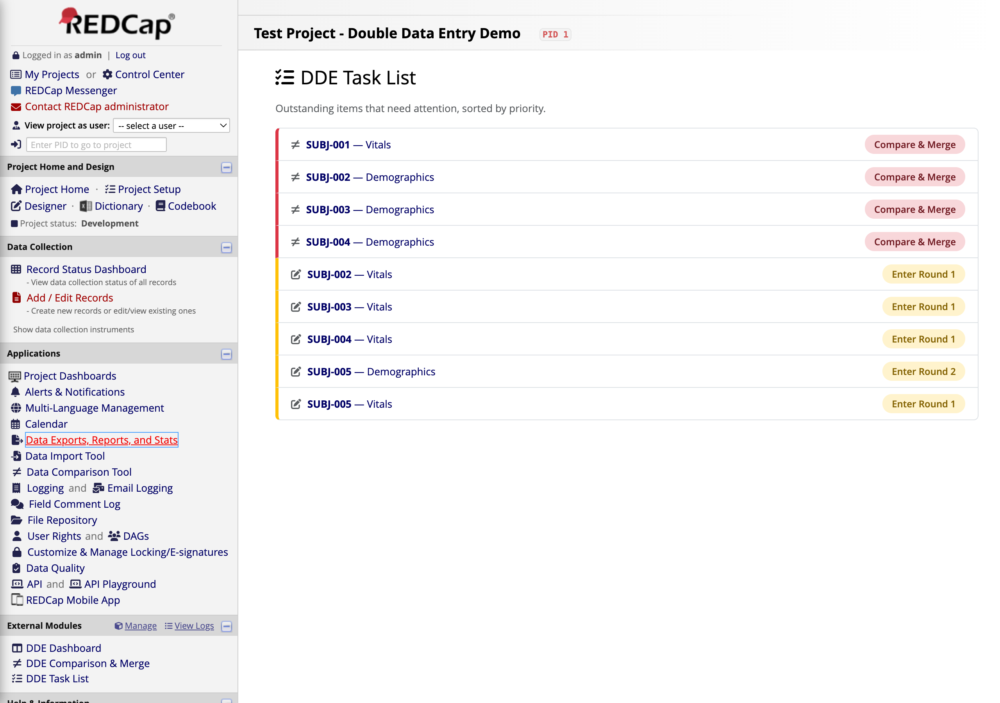
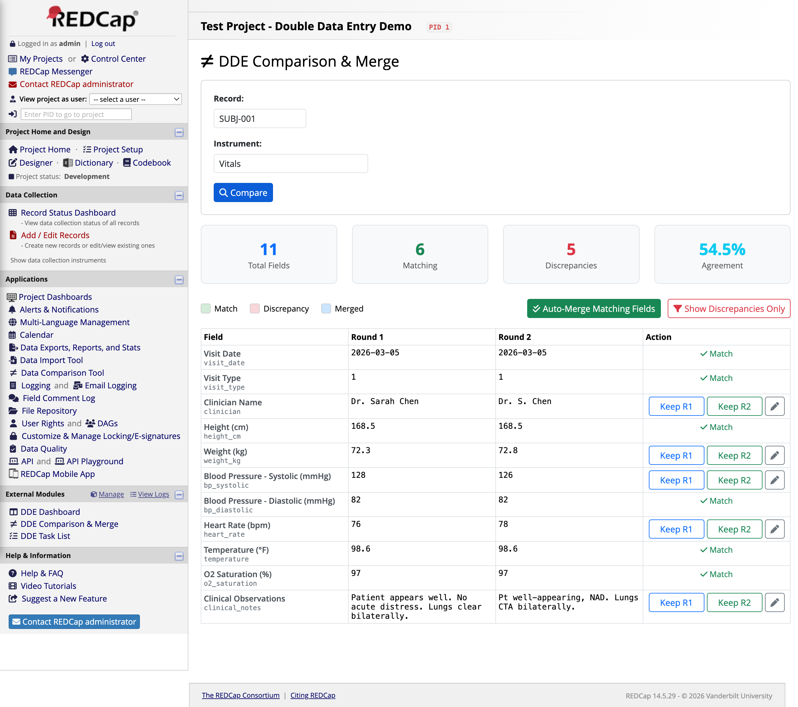
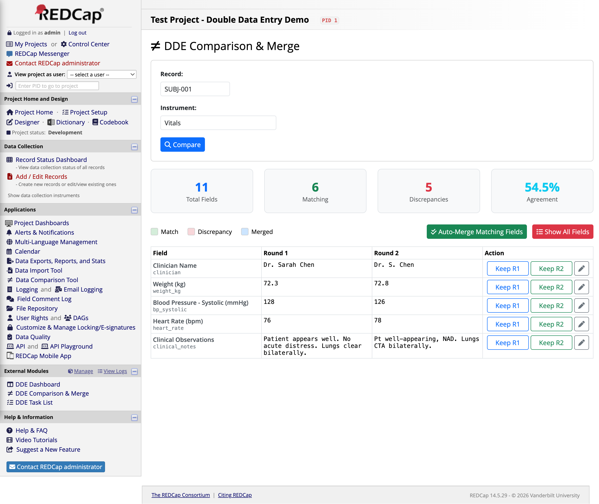
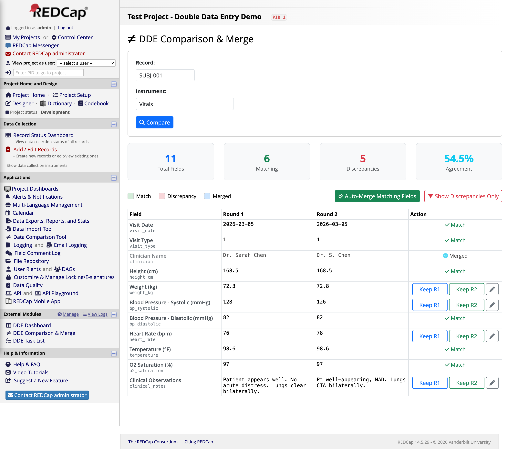
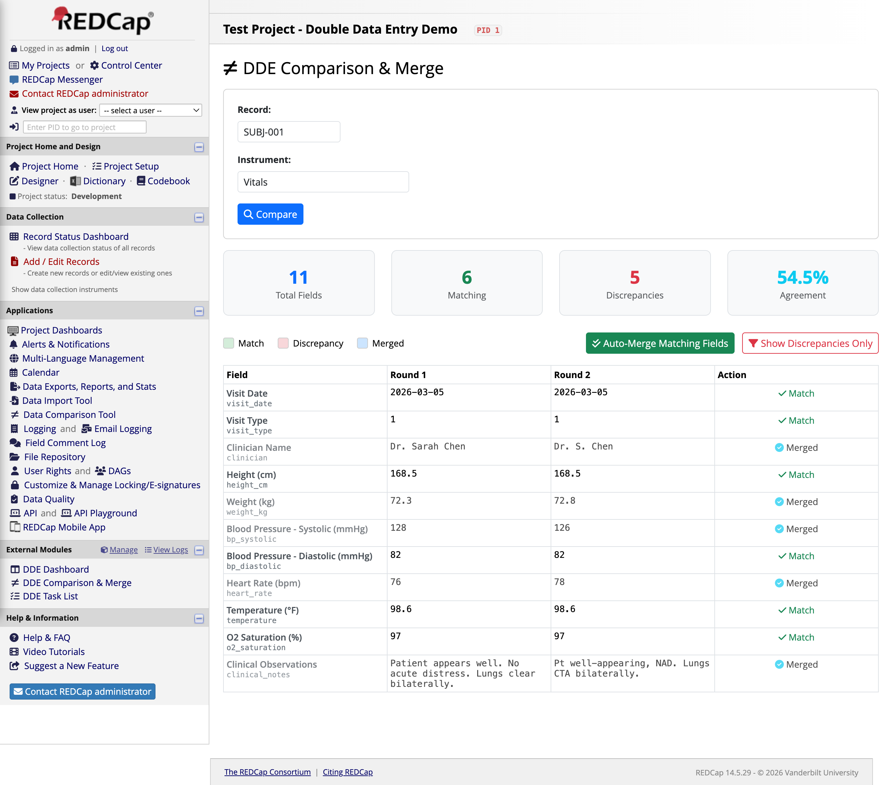
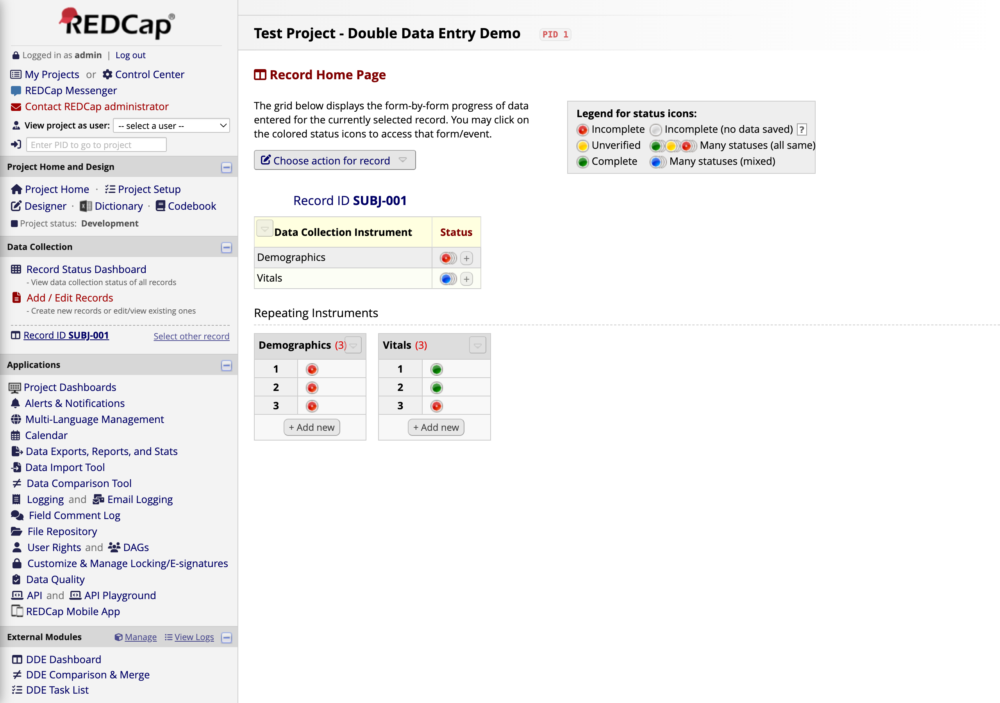

# Easy Double Entry for REDCap

A REDCap External Module that provides double data entry verification without the complexity of REDCap's built-in DDE system. No duplicate records, no `--1`/`--2` suffixes, no special user roles.



## Installation

No special server permissions required — just standard REDCap admin access.

### Requirements

- REDCap 13.0+ with PHP 8.0+
- REDCap admin access (Control Center) to install the module

### Steps

1. **Download** — clone or download this repo
2. **Copy to server** — place the folder in your REDCap `modules/` directory as `easy_double_entry_v1.0/`
3. **Enable server-wide** — go to **Control Center > External Modules** and enable Easy Double Entry
4. **Enable on your project** — go to your project > **External Modules** > enable the module
5. **Select DDE instruments** — in module settings, choose which instruments need double data entry
6. **Enable repeating** — in **Project Setup > Repeating Instruments**, enable repeating for those same instruments
7. **Done** — open the **DDE Dashboard** from the project sidebar

> **Only the instruments you select become repeating.** All other instruments (demographics, scheduling, consent, etc.) remain normal single-entry forms and are completely unaffected. No automation is re-triggered, no scheduling forms need to be re-entered.

## How It Works

### Easy Double Entry vs. REDCap's Built-in DDE

| | Built-in DDE | Easy Double Entry |
|---|---|---|
| **Record structure** | Duplicates the entire record (`101--1`, `101--2`) | Single record, repeating instances on selected instruments only |
| **Which instruments** | All instruments are duplicated — every form must be entered twice | You choose which instruments need DDE; everything else is entered once |
| **Scheduling/intake forms** | Second entry person must re-enter scheduling, demographics, consent — re-triggering ASIs, alerts, and automation | Non-DDE instruments are untouched; no automation is re-triggered |
| **User assignments** | Each record copy is locked to a specific user role; admin must reassign when staff rotate | Any authorized user can enter any round — no role assignments needed |
| **Comparison** | Built-in side-by-side comparison tool | Built-in comparison with one-click merge, bulk auto-merge, and custom value entry |
| **Data exports** | Two separate records per participant; must merge `--1`/`--2` rows in analysis | One record per participant; filter to the merge target instance for clean data |
| **Admin overhead** | High — role management, permission changes for staff turnover | Low — enable module, pick instruments, done |

### This Module's Approach

Easy Double Entry works within a single record using repeating instances on only the instruments you choose:

| Instance | Purpose |
|----------|---------|
| **Instance 1** | Round 1 — first data entry pass |
| **Instance 2** | Round 2 — independent second pass |
| **Instance 3** | Final merged record (verified data) |

**Key point:** A record can have a mix of regular instruments (entered once) and DDE instruments (entered via instances). Your scheduling form, demographics, consent — anything not selected for DDE — works exactly as before.

### Typical Workflow

1. **Staff A** opens Record 101 > "Cognitive Exam" > Instance 1 > enters data
2. **Staff B** opens Record 101 > "Cognitive Exam" > Instance 2 > enters data independently
3. **Reviewer** opens the DDE Comparison page > compares field-by-field > resolves discrepancies > merges to Instance 3
4. Instance 3 now contains the verified, final data

Meanwhile, Record 101's scheduling form, demographics, and any other non-DDE instruments were entered once, normally, with no repeating instances involved.

## Data Export & Analysis

Since DDE instruments use repeating instances, your data exports will include `redcap_repeat_instrument` and `redcap_repeat_instance` columns for those instruments. Here's how to get clean data:

### Getting Only Final (Verified) Data

The merge target instance depends on your module settings:

| Merge Target Setting | Final data lives in | Filter to |
|---------------------|--------------------|-----------|
| **Instance 3** (default) | Instance 3 | `redcap_repeat_instance = 3` |
| **Instance 1** (overwrite Round 1) | Instance 1 | `redcap_repeat_instance = 1` |

Check your module settings to confirm which mode you're using, then apply the appropriate filter.

**REDCap Reports:** Add a filter where `[redcap_repeat_instance]` equals your merge target instance.

**API Exports (R, Python, etc.):**
```r
# R — default merge target (Instance 3)
final_instance <- 3  # change to 1 if merge target = "Overwrite Round 1"
clean <- data %>% filter(redcap_repeat_instance == final_instance | is.na(redcap_repeat_instance))
```
```python
# Python — default merge target (Instance 3)
final_instance = 3  # change to 1 if merge target = "Overwrite Round 1"
clean = df[(df['redcap_repeat_instance'] == final_instance) | (df['redcap_repeat_instance'].isna())]
```

The `is.na()` / `isna()` clause keeps rows from non-repeating instruments (which have no instance number).

### What Each Instance Means (Default: Merge to Instance 3)

| Instance | What it contains | Keep for analysis? |
|----------|-----------------|-------------------|
| 1 | Round 1 raw entry | No (audit trail only) |
| 2 | Round 2 raw entry | No (audit trail only) |
| 3 | Final merged/verified data | **Yes** |

> If your merge target is set to "Overwrite Round 1", Instance 1 contains the final data and Instance 2 is the audit trail. There is no Instance 3 in that mode.

### Non-DDE Instruments

Instruments not selected for DDE have no `redcap_repeat_instance` value — they export exactly as they always have. No filtering needed.

## Module Pages

The module adds three pages to your REDCap project sidebar:

### DDE Dashboard

Project-wide overview showing every record with color-coded instrument badges and overall DDE status (Pending, Partial, Ready to Compare, Merged).


### DDE Task List

Prioritized action items — records ready for comparison appear at the top, followed by instruments still awaiting data entry. Each task links directly to either the data entry form or the comparison page.



### DDE Comparison & Merge

Side-by-side field comparison with match/discrepancy detection:



**Discrepancy filtering** — click "Show Discrepancies Only" to focus on fields that need attention:



**Resolving discrepancies** — click Keep R1 or Keep R2 to accept a value, or use the edit button to enter a custom merged value. Resolved fields turn blue:



**All resolved** — every field shows either Match (green) or Merged (blue):



After merge, Instance 3 contains the verified data alongside the two original entries:



## Settings

| Setting | Description |
|---------|-------------|
| **DDE Instruments** | Which forms require double entry (select from form list, repeatable) |
| **Filter Rules** | Field/value pairs that control instrument visibility per participant |
| **Merge Target** | Write merged values to Instance 1 or Instance 3 (default: Instance 3) |
| **Require Comment** | Force a comment when resolving discrepancies (audit trail) |
| **Notification Email** | Get notified when both rounds are complete |

## Compatibility

- REDCap 13.0+, PHP 8.0+, Framework Version 14
- Works with: classic projects, longitudinal, repeating instruments, DAGs
- Upgrade-safe: no core modifications, pure External Module

## FAQ

**Q: Will this mess up my existing data exports?**
A: Only DDE-enabled instruments get repeating instances. Filter to Instance 3 for clean verified data. All other instruments export exactly as before.

**Q: Does the second data entry person need to fill out our scheduling/intake forms again?**
A: No. Only the instruments you select for DDE use repeating instances. Scheduling, demographics, consent, and any other forms are entered once, normally.

**Q: Can I use this on a longitudinal project?**
A: Yes. The module tracks event IDs and works across multiple arms/events.

**Q: What permissions do users need?**
A: Standard REDCap data entry rights on the instrument. No special DDE roles or user assignments required.

**Q: What happens if I disable the module later?**
A: Your data remains in REDCap as repeating instances. Your merge target instance (Instance 3 by default, or Instance 1 if configured) still holds the verified data. You just lose the dashboard, task list, and comparison UI.

## File Structure

```
easy_double_entry_v1.0/
├── EasyDoubleEntry.php      # Core module class (AJAX router, comparison, merge logic)
├── config.json              # Module configuration and settings schema
├── README.md
├── LICENSE                  # MIT
├── pages/
│   ├── dashboard.php        # DDE Dashboard page
│   ├── tasklist.php         # Task List page
│   └── compare.php          # Compare & Merge page
└── docs/
    ├── tutorial.html        # Visual walkthrough (self-contained HTML)
    └── images/              # Tutorial screenshots
```

## Tutorial

A complete visual walkthrough is available at [docs/tutorial.html](docs/tutorial.html) covering the full workflow from dashboard to merged record.

**Hosted version:** [https://report.cincibrainlab.com/ede-tutorial/](https://report.cincibrainlab.com/ede-tutorial/)

## License

MIT — see [LICENSE](LICENSE)

## Author

Ernest Pedapati — Cincinnati Children's Hospital Medical Center
